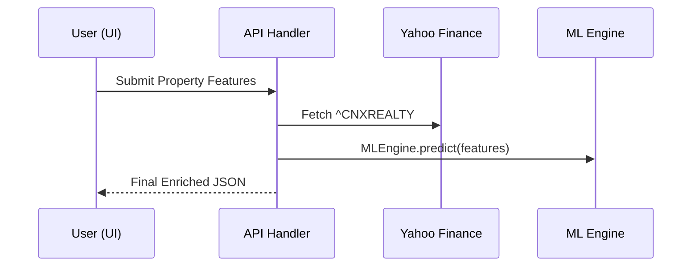
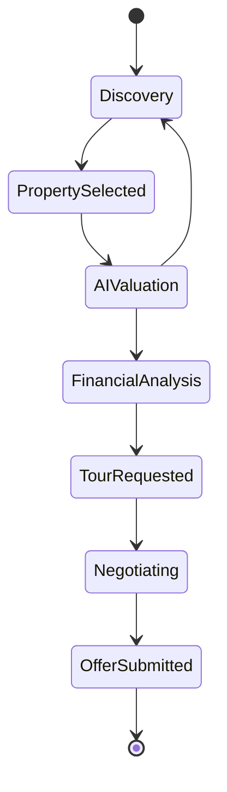
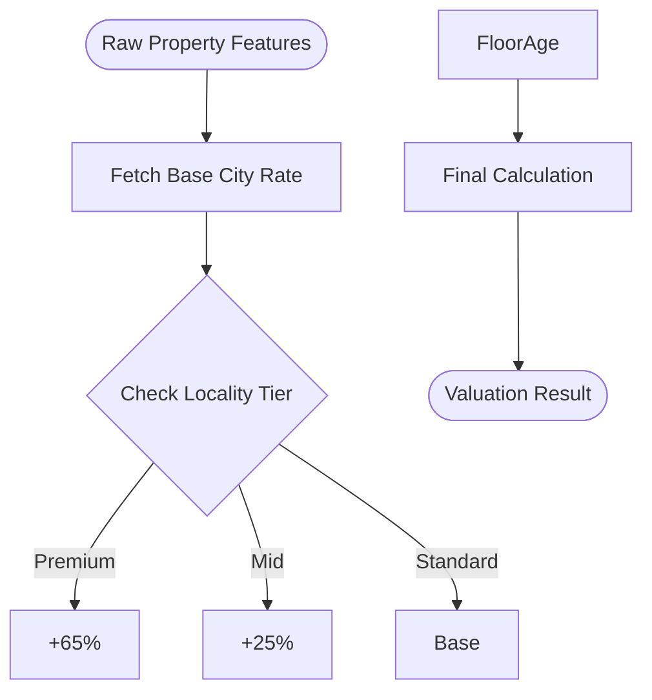
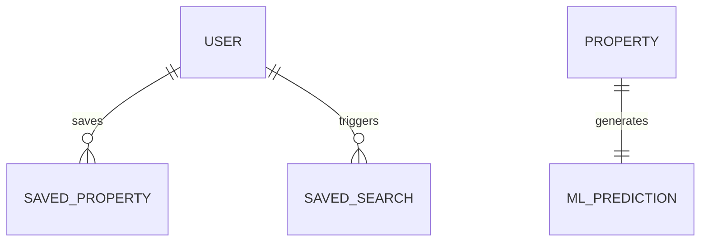

# HomieNest: Project Architecture & UML Diagrams

---

## 1. System Macro-Architecture
```mermaid
componentDiagram
    [User Browser] as UI
    [Next.js App Router] as Auth
    [API Predict Route] as API
    [MLEngine Module] as ML
    [Nifty Realty Index] as YF
    [Google Maps API] as Maps
    [Firebase DB] as DB

    UI --> Auth
    Auth --> API
    API --> ML
    API --> YF
```

---

## 2. Dynamic Valuation Pipeline


---

## 3. Buyer Transaction Lifecycle


---

## 4. ML Feature Processing Logic


---

## 5. System Entity Relationships

